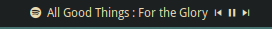

# Spotify Polybar

Polybar modules, developed in bash scripts, that allow you to view the status of spotify, as well as manage its most basic options such as starting or pausing a song, going to the next song or the previous song.



## Prerequisites


[Playerctl](https://github.com/altdesktop/playerctl)
[NerdFonts](https://www.nerdfonts.com/)


## Installation

Assign Execute Permissions

```
  sudo chmod +x spotify-status.sh
  sudo chmod +x spotify-play-pause.sh
  sudo chmod +x spotify-next.sh
  sudo chmod +x spotify-prev.sh
```

## Usage

Add as scripts in polybar config file
```
; -- spotify --
[module/spotify]
type = custom/script
interval = 1
tail = true
format = <label>
exec = /folder-ubication/./spotify-status.sh

[module/spotify-prev]
type = custom/script
interval = 1
tail = true
format = <label>
exec = /folder-ubication/./spotify-prev.sh
click-left = playerctl -p spotify previous

[module/spotify-next]
type = custom/script
interval = 1
tail = true
format = <label>
exec = /folder-ubication/./spotify-next.sh
click-left = playerctl -p spotify next

[module/spotify-play-pause]
type = custom/script
interval = 1
tail = true
format = <label>
exec = /folder-ubication/./spotify-play-pause.sh
click-left = playerctl -p spotify play-pause

; -- end spotify --
```
